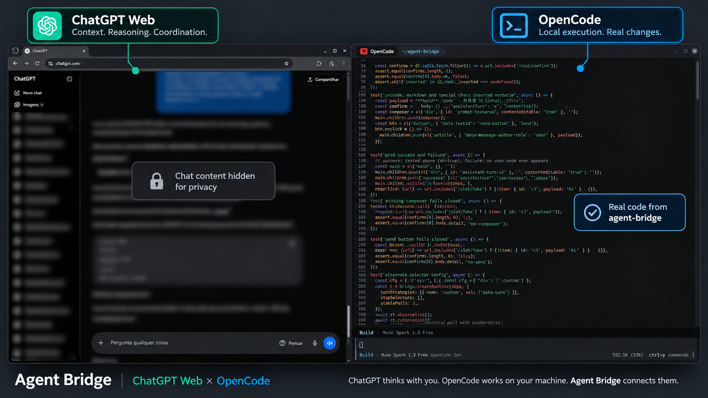

# Agent Bridge — ChatGPT Web + OpenCode

**Give ChatGPT hands-on access to your local codebase.**

Agent Bridge connects ChatGPT Web to OpenCode, allowing ChatGPT's
conversational context to drive a coding agent running directly on your
machine.

**ChatGPT thinks with you. OpenCode works on your machine. Agent Bridge
connects them.**

```
ChatGPT Web → Agent Bridge → OpenCode → Your machine
```



*Sanitized capture of the bridge in action (v0.1): ChatGPT Web conversation content hidden for privacy; OpenCode terminal showing real Agent Bridge code.*

Independent project. **Not affiliated with or endorsed by OpenAI or the
OpenCode maintainers.** Product names appear only descriptively, never in
our own claims of endorsement.

## Why this exists

A ChatGPT conversation holds rich context — the problem discussion, the
decisions, the corrections — but it cannot touch your local codebase. A
local coding agent can touch everything but starts each task from a bare
prompt. Agent Bridge closes that gap: ChatGPT uses the context available in
the conversation to produce and direct instructions, and the bridge delivers
them to an OpenCode agent running locally under explicit operational gates.
To be precise: the system does **not** transfer your personal context
automatically — it transports the instructions ChatGPT produces from that
context, with every delivery attempted once, gated, proven, and audited.

## The idea

ChatGPT Web provides the context and coordination. OpenCode provides local
execution. Agent Bridge connects them — a controlled, auditable middle that
gives the coordinator hands without giving it unsupervised control.

## How it works

1. A ChatGPT response stabilizes; the browser companion builds a source
   envelope (`generating/finished/texts`).
2. The bridge validates the envelope, waits for a finished response, and
   extracts the transportable instruction.
3. `opencode run` executes it in your project directory (`--dir`), and the
   run's output hash proves what actually arrived.
4. Session output flows back through a versioned source, a take-once slot,
   and the companion, which inserts it into the ChatGPT conversation with
   DOM proof.

## Architecture

- `core/` — product-free rules (delivery slot, gates, state, fuses,
  lifecycle, protocol, policies, sources). Never imports `adapters/`.
- `adapters/chatgpt/` + `extension/` — observe ChatGPT Web (configurable
  selectors; fragile DOM knowledge isolated in config), insert back with
  proof. Text-only payloads, never executed.
- `adapters/opencode/` — `opencode run` injector and read-only session
  source (verified against the installed CLI; internal store, re-verify on
  upgrade).
- `adapters/` shared — localhost HTTP slot/observation, subprocess
  reference transports.

See `docs/ARCHITECTURE.md`, `docs/PROTOCOL.md` and `AGENTS.md`.

## A real request flow

```
ChatGPT answer stabilizes
  → envelope {generating:false, finished:true, texts:[...]}
  → finished text → Delivery.put → gate OPEN → attempt
  → opencode run --dir /your/project "instruction"
  → stdout hash matches → settle delivered (audit)
```

## Why the architecture is different

Coding agents plugged directly into a chat product execute inside that
product's environment and trust model. Agent Bridge inverts this: execution
stays on your machine, inside tools you installed, under gates you can read
(`open/paused/safety_hold`), with every attempt audited and every proof
checked independently. These are architectural differences — local,
gated, and auditable versus hosted and implicit — not a claim of
superiority and not a claim about what any vendor does or does not offer.

## Safety/control model

One-shot delivery (no retries, no queues); take-once slots; content dedupe;
gates checked at put AND take; turn/rate/repetition fuses latching to
`safety_hold`; explicit per-cycle driver with no hidden clocks; proofs
required from evidence, never from return values; localhost-only HTTP with
no auth/CORS (the machine is the trust perimeter — never expose it).

## Quick start

Requires Python 3.8+ (tested on 3.12), no dependencies. Node.js only for
the browser-companion JS suites (skipped automatically when absent).

```bash
cd agent-bridge
python3 -m unittest discover -s tests
node --test tests/chatgpt/observer.test.mjs tests/extension/content.test.cjs
```

All 256 Python tests and all 16 JS tests should pass.

## Limitations

- ChatGPT Web DOM is not a stable API: selectors will need updates.
- OpenCode's session store is internal: re-verify per upgrade.
- Single slot per direction; no auth (localhost only); no persistence,
  scheduler, daemon, or panel yet.
- Tests cover contracts and deterministic behavior, not live products.

## Project structure

```
core/       generic rules (no I/O, stdlib only)
adapters/   chatgpt/ opencode/ (+ HTTP, subprocess references)
extension/  MV3 browser companion (observe → POST, poll → composer → proof)
tests/      contract tests (Python unittest) + hermetic JS suites
docs/       ARCHITECTURE.md, PROTOCOL.md
```

## Development / AGENTS

Coding agents working here must read `AGENTS.md` first: thesis,
boundaries, environment-dependent parts, validation, and prohibitions
(no commits/pushes/renames without explicit orders, no secrets, no
production claims beyond what tests demonstrate).
